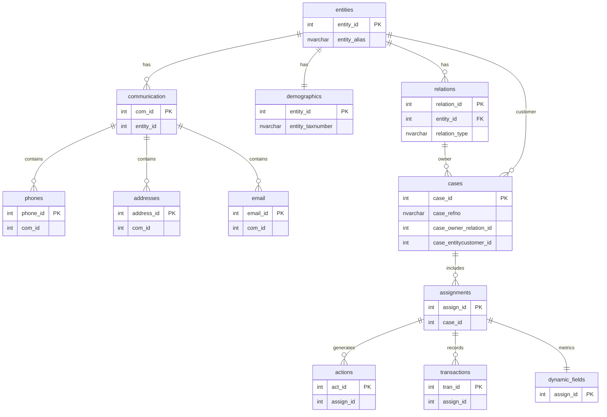

# sql-bi-portfolio
SQL / BI Portfolio using Microsoft SQL Server

# Demo Collection Database
## Overview

This project demonstrates a relational database design for a debt collection system.

The database models the lifecycle of a collection case including:

- customers (banks, utility companies)
- debtors and related entities
- case assignments
- collection actions
- payment transactions
- communication data

The schema is designed to track the historical evolution of each case, including multiple assignments, payments and agent activities.

## Core Concepts

The system distinguishes between three main roles:

**Customer**
The organization that owns the debt (e.g. NBG, Alpha Bank, DEH).

**Owner**
The debtor responsible for the obligation.

**Agent**
The collection operator who performs actions such as calls, emails and case handling.

Agents appear as system actors performing actions but are not considered owners or customers.

## Entity Relationship Diagram

## Example Case Lifecycle

A typical case lifecycle may look like this:

Monday
- Case is assigned to the collection system
- Agent contacts the debtor

Tuesday
- Debtor makes a partial payment
- Case is revoked

Wednesday
- A new invoice becomes overdue
- A new assignment is created

Thursday
- Agent performs another contact attempt

## Dynamic Fields

The `dynamic_fields` table stores operational metrics for each assignment.

Examples:

- initial bucket (bucket when the case was assigned)
- current bucket
- debt amount
- balance amount
- last payment
- total paid amount

Each assignment has exactly one dynamic_fields record.

## Setup

1. Create the database

CREATE DATABASE DemoCollectionDB;

2. Run the schema script

schema.sql

3. Insert sample data

sample_data.sql

## Example Query

Retrieve the latest balance for a case:

SELECT
c.case_refno,
d.dyn_balance_amount
FROM cases c
JOIN assignments a ON c.case_id = a.case_id
JOIN dynamic_fields d ON a.assign_id = d.assign_id

## Technologies

SQL Server
Relational Database Design
Data Modeling

## Future Improvements

Possible extensions:

- agent performance reporting
- automated bucket updates
- payment-invoices schedule tracking
- integration with CRM systems
